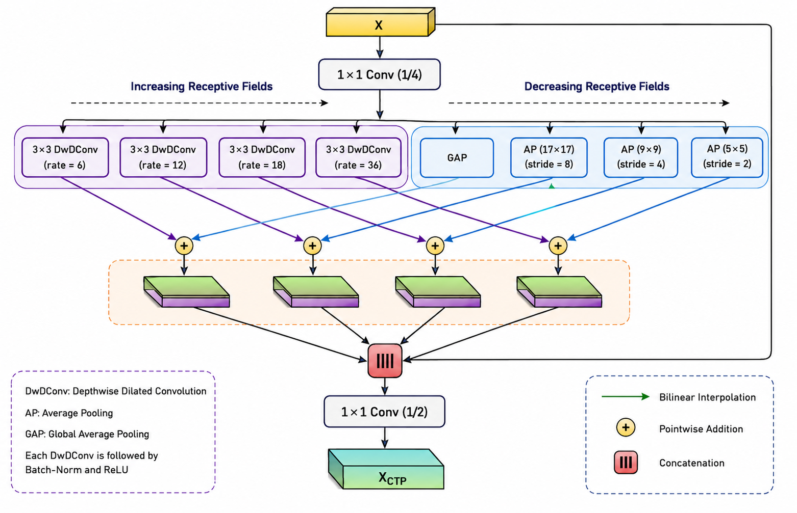
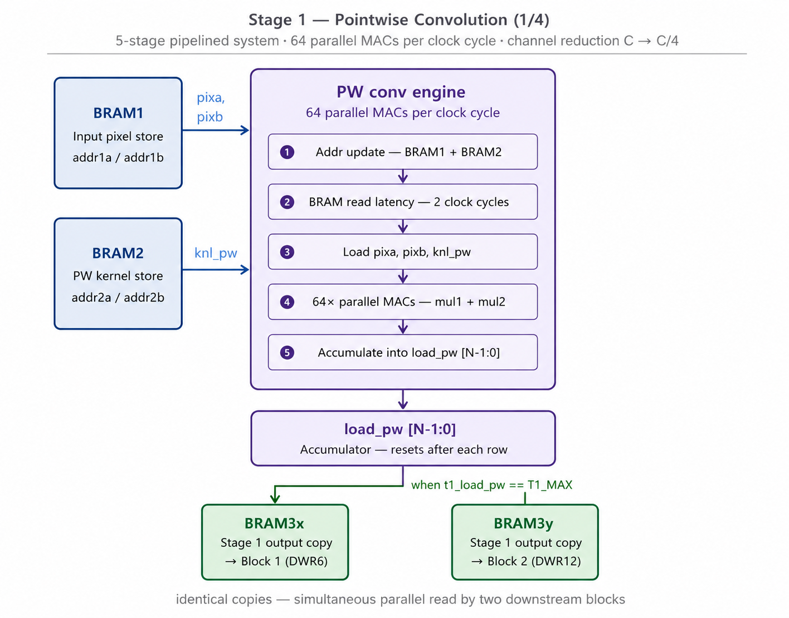
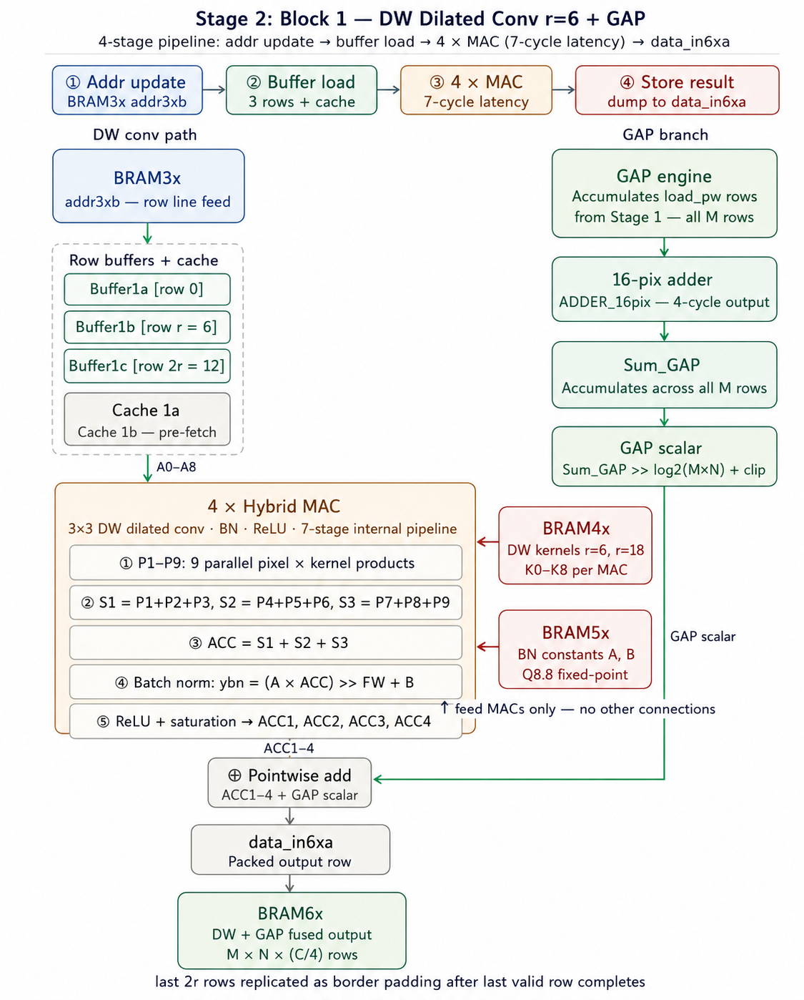
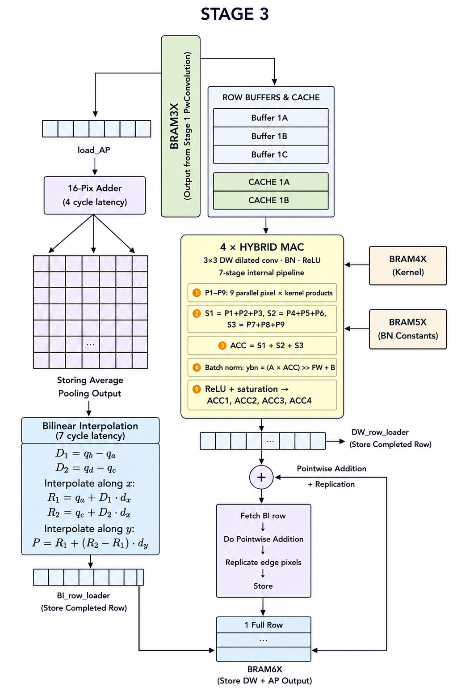
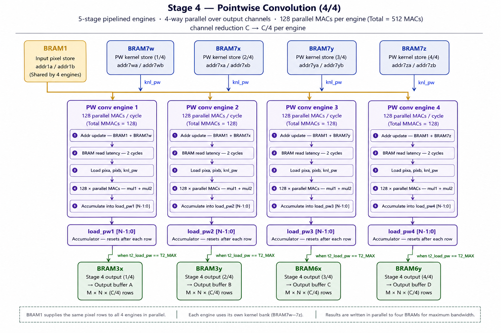
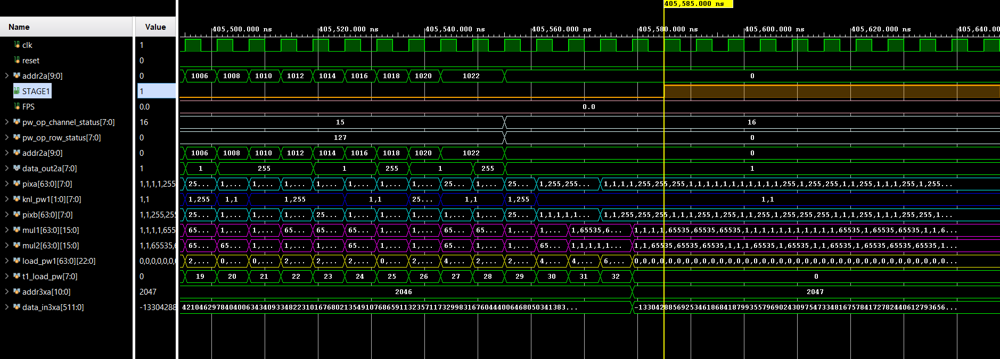
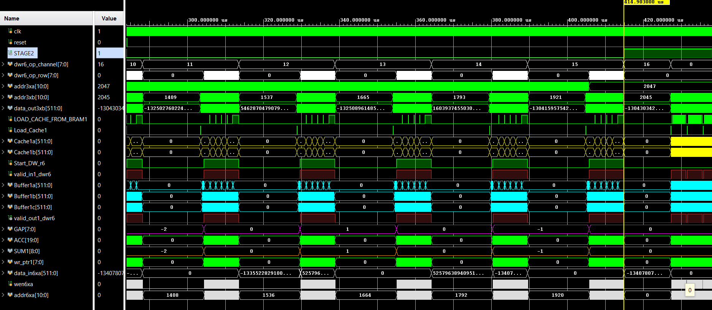
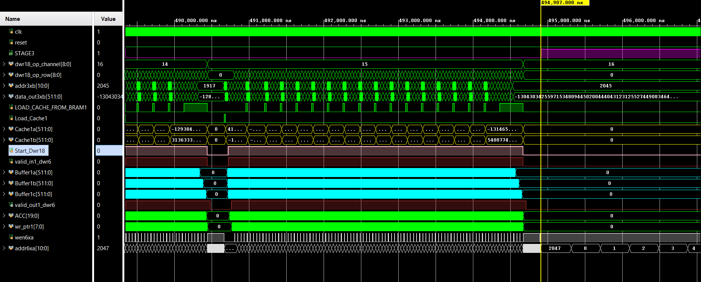
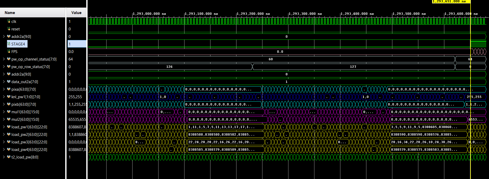

# FPGA-based Hardware Accelerator of CTP Module for Autonomous Vehicles
### Complementary Twin Pyramidal Module for Real-Time Semantic Segmentation


---

## Overview

This repository presents the **FPGA hardware acceleration** of the 
Complementary Twin Pyramidal (CTP) module — a lightweight multi-scale context
aggregation block originally proposed as part of **CTPNet**, a real-time
semantic segmentation architecture for autonomous/driverless vehicle perception.

The hardware accelerator maps the CTP module's dual-branch contextual
aggregation pipeline onto a **fully pipelined, parallel FPGA datapath**,
targeting the Xilinx Virtex-7 VC707. The design achieves **774 FPS at 166 MHz
with 0.77 W**, outperforming all comparable FPGA-deployed contextual modules
in the literature.

> **This work is an extension of Associated Paper:** CTPNet — accepted for publication in
> *IEEE Transactions* (2026).

---

## Performance Summary

| Metric                    | Value                        |
|---------------------------|------------------------------|
| Input Dimensions          | 128 × 64 × 64                |
| Trainable Parameters      | 30,000 (~0.03 M)             |
| Total MACs per Frame      | 80 M (0.08 GMACs)            |
| Total FLOPs per Frame     | 167 M (0.167 GFLOPs)         |
| Operating Frequency       | **166 MHz**                  |
| Frame Rate                | **774 FPS**                  |
| Latency per Frame         | **1.29 ms**                  |
| Sustained Throughput      | 129.3 GFLOP/s / 62 GMAC/s   |
| Clock Cycles per Frame    | 215,605                      |
| Pixel Throughput          | 6.50 Mpixels/s               |
| DSP Efficiency (η_DSP)    | **0.364 GFLOP/s/DSP**        |

### Resource Utilization — Xilinx Virtex-7 VC707

| Resource | Used     | Available | Utilization |
|----------|----------|-----------|-------------|
| DSPs     | 355      | 2800      | **12.6%**   |
| LUTs     | ~74,558  | 485,760   | **~15.3%**  |
| BRAMs    | 1.65 MB  | 4.5 MB    | **36%**     |
| Power    | 0.77 W   | —         | —           |

---

## Comparative Analysis

Comparison against full segmentation networks and contextual modules on FPGA
or custom hardware:

| Method          | Params (M) | GFLOPs | Power (W) | FPS  | Lat. (ms) |
|-----------------|-----------|--------|-----------|------|-----------|
| ENet            | 0.36      | 3.8    | 7.3       | 31   | 32.3      |
| SegNet          | 29.5      | 286.0  | 25.0      | 7    | 142.9     |
| ICNet           | 26.5      | 28.3   | 10.5      | 68   | 14.7      |
| ERFNet          | 2.1       | 25.6   | 6.2       | 83   | 12.0      |
| BiSeNetV2       | 49.0      | 55.3   | 14.8      | 102  | 9.8       |
| ASPP            | 2.1       | 12.4   | —         | —    | ~4.0      |
| LightASPP       | 0.72      | 1.8    | 3.1       | —    | 5.2       |
| SE-Block        | 0.12      | 0.3    | 0.6       | —    | 1.2       |
| **CTP (Ours)**  | **0.03**  | **0.167** | **0.77** | **774** | **1.29** |

> The CTP module delivers a **+3.0% ΔmIoU** improvement, closely matching
> the gains of ASPP (+3.8%) and PPM (+4.1%) while requiring **75–200× less
> computation**. Against hardware-efficient alternatives — LightASPP (+2.1%)
> and CBAM (+1.5%) — the CTP module provides a superior accuracy boost within
> a competitive FPGA footprint.
---

## CTP Module Architecture



The CTP module performs **dual-branch multi-scale contextual aggregation**:

- **Increasing Receptive Field Branch** — 4 parallel Depthwise Dilated
  Convolutions (DwDConv) with dilation rates r = {6, 12, 18, 36}
- **Decreasing Receptive Field Branch** — Global Average Pooling (GAP) +
  3 Average Pooling (AP) layers at scales {17×17, 9×9, 5×5} with Bilinear
  Interpolation upsample
- **Fusion** — Pointwise addition across branches → Concatenation → 1×1
  Conv (1/2) channel projection → Output X_CTP

---

## Hardware Pipeline — 4-Stage Datapath

```
  ┌─────────────────────────────────────────────────────────────────┐
  │  STAGE 1: PW Conv (1/4)  —  Channel Squeezer  Cin → Cin/4      │
  │           5-stage pipelined PW Conv Engine                      │
  └────────────────────────┬────────────────────────────────────────┘
                           │  (Stage 2 starts as soon as first
                           │   output channel of Stage 1 is ready)
  ┌────────────────────────▼────────────────────────────────────────┐
  │  STAGE 2: Dual Parallel Blocks                                  │
  │   Block 1: GAP  +  DwDConv (r=6)   ──┐                         │
  │   Block 2: AP 16×16 + BI + DwDConv (r=12) ──┤  → BRAM6        │
  │           (4 Hybrid MACs per DwD → 4 output pixels/clk)        │
  └────────────────────────┬────────────────────────────────────────┘
                           │  (Stage 3 starts after Stage 1 & 2 have completed)
  ┌────────────────────────▼────────────────────────────────────────┐
  │  STAGE 3: Dual Parallel Blocks                                  │
  │   Block 1: AP 8×8  + BI + DwDConv (r=18) ──┐                   │
  │   Block 2: AP 4×4  + BI + DwDConv (r=36) ──┤  → Concatenation  │
  └────────────────────────┬────────────────────────────────────────┘
                           │
  ┌────────────────────────▼────────────────────────────────────────┐
  │  STAGE 4: PW Conv (1/2)  —  Final Channel Projection           │
  │           4-channel parallel execution (60% of total time)      │
  │           Pixels fetched from BRAM1, 2 rows + 2 kernels/clk    │
  └─────────────────────────────────────────────────────────────────┘


```
### Pipeline Stage Architecture Diagrams

<table>
  <tr>
    <td align="center"><b>Stage 1 — PW Conv (1/4) Channel Squeezer</b><br/></td>
    <td align="center"><b>Stage 2 — DwDConv (r=6,12) + GAP / AP 16×16</b><br/></td>
  </tr>
  <tr>
    <td align="center"><b>Stage 3 — DwDConv (r=18,36) + AP 8×8 / 4×4</b><br/></td>
    <td align="center"><b>Stage 4 — PW Conv (1/2) Final Channel Projection</b><br/></td>
  </tr>
</table>


### Pipeline Depths per Module

| Module / Stage         | Pipeline Depth (Cycles) |
|------------------------|------------------------|
| PW Conv Engine         | 5                      |
| PW Conv MAC Unit       | 2                      |
| AP 16-Pixel Adder Tree | 4                      |
| Hybrid MAC Unit        | 7                      |
| Bilinear Interpolation | 7                      |

---

## RTL Module Descriptions

| Module               | Description |
|----------------------|-------------|
| `CTP.v`          | Top-level integration of all 4 stages; orchestrates inter-stage control |
| `Hybrid_MAC.v`       | Computes dot product of 9 pixels × 9 weights; includes BN + ReLU; produces 1 output pixel/clk |
| `Bilinear_Interpolation.v`  | 7-cycle latency; takes 4 input pixels → 1 output pixel; 6 adders + 3 multipliers |
| `ADDER_16pix.v`       | Accumulates 16 pixels for average pooling; 4-stage pipelined reduction |
| `Latency_tracker.v`  | Parameterizable N-stage shift register; propagates `valid_in` → `valid_out` after exactly N cycles; zero logic overhead |

---

## Design Optimizations

### 1 — Pipeline-First Design
Every processing block is decomposed into fixed-depth register chains with
deterministic latency. Pipeline handshaking is managed by `latency_tracker`
modules — parameterizable N-stage shift registers that propagate valid signals
with zero logic overhead beyond the shift register itself.

### 2 — AP Window Resizing (Division → Shift)
Average pooling windows resized from {17×17, 9×9, 5×5} to {16×16, 8×8, 4×4}.
Division by non-power-of-2 replaced with a single right-shift, eliminating
divider logic entirely from the datapath.

### 3 — Memory-Bandwidth-Aware BRAM Architecture
Each BRAM address stores one complete image row packed into a single wide data
word — a single BRAM read delivers all N pixel values simultaneously,
maximizing bandwidth per access. BRAM reuse strategy:
- BRAM1 repurposed as Stage 4 input buffer
- BRAM6x / BRAM6y reused across Stages 2 and 3
- BRAM3x / BRAM3y shared across all stages
- Stage 4 output distributed across existing BRAMs (BRAM3x, BRAM3y, BRAM6x, BRAM6y)

### 4 — Two-Level Parallelism
- **Intra-Stage (Level 1):** Within Stage 2, Block 1 (DwDConv r=6 + GAP) and
  Block 2 (DwDConv r=12 + AP 16×16) execute simultaneously
- **Inter-Stage (Level 2):** Stage 2 begins processing the first output channel
  of Stage 1 immediately — Stages 1 and 2 overlap as a producer-consumer pipeline

### 5 — Inline packed Buffer Straming
We have kept buffers for all the CNN operations from DwD conv to Pw conv, these 
buffers keeps few rows which are to be processed, this reduces the need of storing
the complete feature map. For example for DWD Convolution we are fetching 3 rows
and this will give us 1 output row, after that 1 row is generated new triplet rows
will come and sit in the same 3 buffer. Moreover we have used Packed buffer, which
are very hardware effective for shifting purpose during convolution.


### 6 — Zero-Stall Row Transitions
Pre-fetch cache registers (Cache1a, Cache1b) hold the next two rows needed
after the current row group completes. Pre-fetch is triggered exactly
MAX_CYC_DWR6−3 cycles before completion, covering the 2-cycle BRAM read
latency plus one cycle of register settling. Buffer swap is instantaneous —
the freshly fetched row arrives in the same cycle as the swap.

### 7 — Stage 4 Channel Parallelization
Stage 4 PW Conv (historically 80–90% of total execution time) parallelized
across 4 channels simultaneously, reducing Stage 4 contribution to ~60% of
total frame time.

---

## Simulation Results

Waveform captures for each pipeline stage:

| Stage | Waveform |
|-------|----------|
| Stage 1 — PW Conv (1/4)    |  |
| Stage 2 — DwDConv (r=6,12) + AP(GAP + 16x16) |  |
| Stage 3 — DwDConv(r=18,36) + AP(8x8 + 4x4)  |  |
| Stage 4 — PW Conv (1/2) |  |

---

## How to Reproduce

### Prerequisites
- Vivado 2024.2
- Xilinx Virtex-7 VC707 board (or target a compatible 7-series device)

## How to Reproduce

### Prerequisites
- Vivado 2024.2
- Xilinx Virtex-7 VC707 board (or target a compatible 7-series device)

### Steps

1. Clone the repository:
```bash
git clone https://github.com/ChhandakRoy/FPGA-Implementation-of-High-Performance-Hardware-Accelerator-for-Autonomous-Vehicles.git
cd FPGA-Implementation-of-High-Performance-Hardware-Accelerator-for-Autonomous-Vehicles
```

2. Open Vivado 2024.2 → Create new project → select **Virtex-7 xc7vx485tffg1761-2**

3. Add all RTL sources:
   - Add `rtl/CTP.v` as Design Sources
   - Add `testbench/ctp_tb.v` as Simulation Source
   - Add `bram` files to respective BRAM IP instances

4. Add constraints:
   - Add `constraints/vc707.xdc`

5. Run simulation via TCL Console:
```tcl
source sim/run_sim.tcl
```

6. For synthesis and implementation:
   - Flow → Run Synthesis → Run Implementation → Generate Bitstream

---

## Skills Demonstrated

- Fully pipelined FPGA datapath design in **Verilog**
- Multi-stage pipeline architecture with **deterministic latency tracking**
- **BRAM-based memory architecture** — bandwidth optimization via wide data words and reuse scheduling
- **Parallel hardware execution** — intra-stage block parallelism + inter-stage pipeline overlap
- Fixed-point arithmetic optimization — **division-to-shift** transformation
- **Zero-stall buffer management** with pre-fetch cache for row transitions
- Hardware implementation of CNN inference operators: depthwise dilated convolution, pointwise convolution, average pooling, bilinear interpolation
- Resource-constrained design: 12.6% DSP, 15.3% LUT, 36% BRAM utilization

---

## Author

**Chhandak Roy**
M.Tech VLSI & Nanoelectronics, IIT Guwahati (2024–2026)
GATE 2024 AIR 256

[LinkedIn](https://www.linkedin.com/in/chhandak-roy-profile/) | [GitHub](https://github.com/ChhandakRoy)

---

